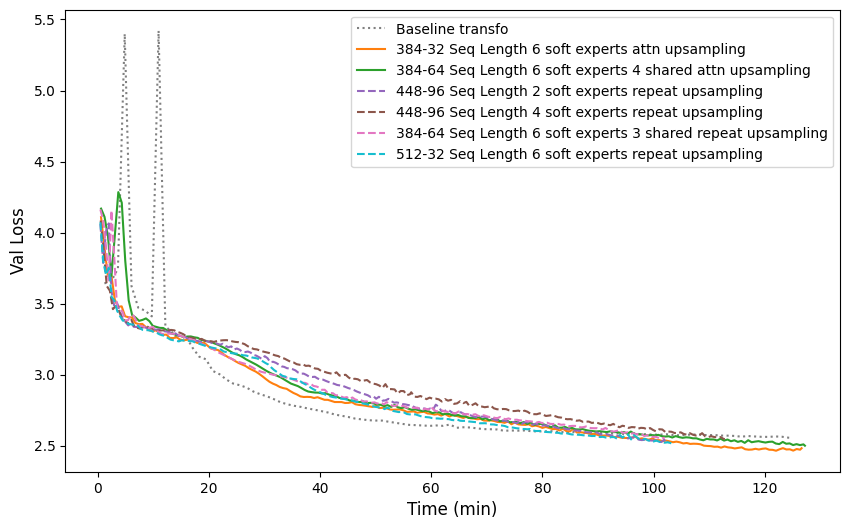

# efficient_transformer

## Core Hypothesis: Composition is Key

We are using this repository to collect various experiments on more efficient transformers. My primary objective is the development of planning algorithms combined with LLMs, but before getting there, it will be necessary to find a way to reduce the inference cost of these models. 

We believe that *composition is one of the keys to obtaining more generalist and data-efficient models*. My implementation of this intuition involves separating the different distributions or information from a single dataset and training several versions of the same model on each of these distributions.

In addition to potentially better generalization, we also *gain efficiency and parallelization capacity* for training the model since we are no longer focusing on one large block but on a set of blocks that can be trained asynchronously. we envision a potentially more generalist central module to which we will add information from sub-experts in an adaptive way, meaning that we will decide when to include the sub-experts, and the number may potentially vary. we will share in the following some documents related to the subject among many others that we find very interesting.

The paper on the [cBTM architecture](https://arxiv.org/pdf/2303.14177.pdf) has already shown that training experts on subsets of the same dataset discovered by unsupervised learning could match or even exceed the performance of a dense model. However, at inference time, they used a discrete router based on input clustering, associating it with the k-nearest subsets of the dataset and having it processed by the k associated experts. we am more interested in a router that is learned as in [PHATGOOSE](https://arxiv.org/pdf/2402.05859.pdf), as it seems to promise more comprehensive performance. we like the idea of having a gate (linear layer followed by a sigmoid in their case) at the input of an expert that can tell whether this expert will contribute to the processing of the input or not. This is reminiscent of the classic MoE, with the difference that here we find a model already trained on its dataset and for which we will only try to learn when it is most relevant to include it in the processing. They chose to train each gate separately, which again has the advantage of being highly parallelizable, but one might wonder if letting the gates become aware of the existence of the other sub-modules would allow them to better discern when the information produced by other sub-experts is not relevant enough and requires their involvement. At inference time, they take the top-k gates that have the most affinity with a given activation to determine when to include an expert or not.

To compose the information from the experts to the central module to enrich its features and produce new capabilities, we am thinking of moving towards something similar to [CALM](https://arxiv.org/pdf/2401.02412.pdf), which performs a cross-attention operation at each layer between the features of a base model (Query) and those of the model to which we want to add knowledge (Key and Value). They demonstrated that this was much more relevant than fine-tuning the base model on the expert model's dataset, thus suggesting that it is probably more interesting and efficient to divide the tasks and then compose than to rely on a large model that does and stores everything.

## Inspiration from Recent Research - Preliminary Explorations and Architectural Tweaks

Before embarking on this composition phase, we thought it was more relevant to optimize the basic architecture of each expert and the central module as much as possible. we started with [Mirasol](https://arxiv.org/pdf/2311.05698.pdf), which provides excellent results for its size. However, we moved towards a more "any modal" version without the two separate audio/video and text pathways. To further increase computational efficiency, we introduced a notion of groups in my sequence of tokens, and each group will provide K latent embeddings, and then we upsample somewhat like in [Hierarchical Perceiver](https://arxiv.org/pdf/2202.10890.pdf). To gradually reduce the input size, we explored a Perceiver encoder and a Transformer encoder from which we retrieve the last K tokens after processing, as in Mirasol. The Perceiver encoder is faster than the Transformer but performs less well than the Transformer encoder, similar to what was observed in [Mirasol](https://arxiv.org/pdf/2202.07765.pdf). we continued with the Transformer.

In the end, we end up with an encoder block (which consists of several series of input size reductions and processing of this new sequence) and a latent block, the most important one that will take the vast majority of the processing, and then we upsample in a series of layers called decoders. In practice, we add positional embeddings in each encoder layer after compression and in each decoder layer after upsampling, which seems to have helped. These layers are shared between the encoder and decoder.

Moreover, the processing of each block is done through a transformer. To increase expressiveness while further reducing the computational cost, we postulated that for a certain size limit of the sequence in the latent block, it is probably more interesting to have several channels of the same sequence (i.e., several different q, k, v) rather than to have a very long sequence in the central block that separates encoder and decoder, the latent block. Notably, if we reduce the initial latent size from K to K/m, we go in the attention module from K^2 to s * (K/m)^2 with s the number of additional q, k, v. The paper closest to this idea is probably Noam Shazeer's on [talking heads attention](https://arxiv.org/pdf/2003.02436.pdf), with the difference that here we have s different linear layers that will provide me with s query, s key and s value vectors. In other words, for each si (i ranging from 1 to s) we have a qi, a ki and a vi that will interact on several heads according to the self-attention module of the vanilla transformer. They can be likened to experts who will extract totally different information on the same sequence. we preserve the s different features at the output of the attention module in a single vector and each will go through a dedicated MLP and then we merge them by performing a convex combination of the s different features with the coefficients coming from a softmax applied to them, a bit like in the [SoftMoE](https://arxiv.org/pdf/2308.00951.pdf). On the other hand, the dimension of the MLPs applied to each of the s experts is a multiple of the dimension of a vanilla MLP divided by s. The number of multiples is a hyperparameter. Merging via max and mean of the features was also considered, but according to the first experiments, this performed less well than the chosen version, which is logical given the absence of non-linearities, but in return, we spend more computation time.

It is conceivable that the longer the sequence, the more information there will be to extract. The same goes for the size of the model, the larger it is, the denser and richer the features will be and the more we will potentially gain by doing so. A variant allowing to share part of the MLPs while using the same number of qkv and specialized MLPs was also studied following [DeepSpeek MoE](https://arxiv.org/pdf/2201.05596). This allows, among other things, to dedicate a space to store the information common to the experts and thus to increase the specialization of the MLPs associated with each of them.

For upsampling in the decoder, we opted for a replication of the nearest previous group until the appropriate size was reached once the current group sequence was added. See the code for more information. This approach generally performs well, but the lack of contextual understanding due to simple replication without taking position into account can limit expressiveness. After discovering the paper on [Hourglass Transformers](https://arxiv.org/pdf/2110.13711), which also investigated a U-net architecture for transformers, we also investigated their method of upsampling via attention.

## Experimental Setup

The experiments were carried out with a base model of 19.55M without soft experts and 20.48M (n_layer=26, n_head=8, n_embd=256) for a vanilla transformer following the architecture used in the [nanoGPT repository](https://github.com/karpathy/nanoGPT). It was the best we could do to be able to iterate easily and assess the impact of different tweaks on the architecture since we am working on Google Colab. Similarly, the lr schedule has not been extensively tuned. For both architectures, we considered an lr max of 4.8e-4 and a final lr of 10% of this value. [A linear schedule was used which provides same performances as the cosine schedule which does nothing magical](https://arxiv.org/pdf/2310.07831) for which we warmup for 50% of the dataset and decay until 85%. Overall, all experiments were performed for each of the two upsamplers, and generally, the attention upsampler scales better with the number of parameters but consumes more computation time, which is to be expected.

We consider the shakespear_char dataset and split it into 80% for training, 10% for validation and 10 for test. Following the paper about [Hourglass Transformers](https://arxiv.org/pdf/2110.13711), we evaluate our model on the validation set splitting it into overlapping sequences of size l=769, with a step size of 32 and calculate the val loss over the last 32 tokens. 

## Key Observations

**To summarize the results:**

* The more experts there are, the better the results are up to a certain point (generally until at least 6 you can expect good perf/compute).
* Increasing the size of MLPs also seems to help, as does increasing the size of the latent vectors in the encoders or in the latent space.
* Since large seq lengths in the encoder blocks or the latent blocks is better, we can allow much larger ones with the repeat upsampling which take less time to compute than the attention version.
* Increasing the frequency of layers with soft experts also seems to help in the context of attention upsampling.
* Sharing MLPs between experts in addition to their specialized MLP associated with them instead of increasing the number of qkv and the number of specialized MLPs guarantees similar performance in terms of log-likelihood to the classic variant while being faster since there is less attention to compute, regardless of the total number of experts and the size of the sequence in the latent space. So generally the best performing way (log-likelihood/compute) to use the attention upsampling is to combine it with some shared experts.
* Using [Denseformer](https://arxiv.org/pdf/2402.02622) in the latent blocks only helps for attention upsampling.
* The latent reconstruction loss employed in [Mirasol](https://arxiv.org/pdf/2311.05698) does not help here. It is difficult to say whether this is due to the radically different scale (20M vs 3B) or if it is due to the modality (Mirasol was a VLM while we try just an LM).

**Plot:**

For illustration purpose, we shared bellow a fig with some of the best configs compared to the baseline transformer. The transformer was trained for one epoch, while variants of our architecture were trained for two epochs since they are substantially faster. All models lr were fully decayed (same schedule as stated above, only the amount of data seen differs). 
We would like to emphasize that these are results for the chosen lr schedule and on the shakespear_char dataset. More experiments on diverse datasets including evals on downstream tasks as well as tuning the hp and scaling the models are needed to have the full picture [as demonstrated here](https://arxiv.org/pdf/2207.10551). 

We can observe that models with attention upsampling take more time than those using the repeat upsampling as expected. Although they have similar performance at the end of the repeat upsampling models trainings. So if one is looking purely for speed, the repeat upsampling version offers generally a good tradeoff. Nevertheless, in most experiences made we still noticed that the attention version scales better with compute. Both models are, when configure correctly, a lot faster than the vanilla transformer architecture while achieving the same validation loss (at least 50% flops reduction at inference when we consider the attention upsampling and even more with the repeat version). 

You can find loss curve progression for some of the experiences made in the **assets folder**. 

## TODO

* Need to rebuild muP, arch has evolved quite a bit. The current implementation is obsolete....
* Add the transformer model arch i used.

## Acknowledgments

This project wouldn't be possible without the fantastic work of Andrej Karpathy and his repository, [nanoGPT](https://github.com/karpathy/nanoGPT). The original codebase provided a starting point, which were instrumental in developing this project. I am incredibly grateful for his work in the open source community globally.
